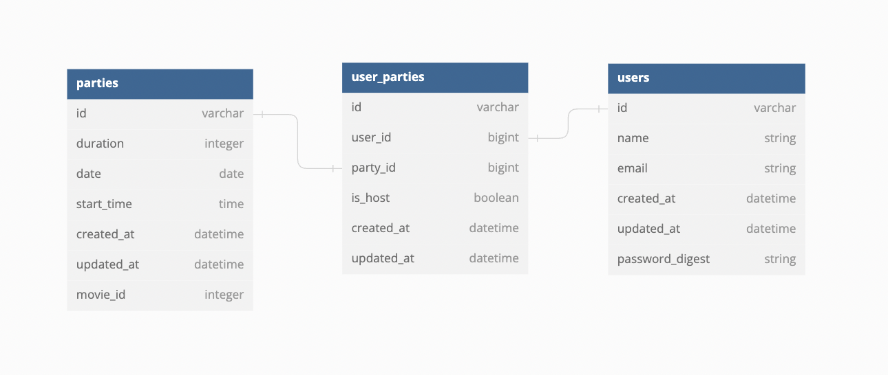

 
 

# [🔵🟢🟡 Take me to the site! 🟡🟢🔵](https://viewing-party-lite2207.herokuapp.com/)

# "Viewing Party Lite" is a paired project where a user can create an account, search for a movie, and invite their friends to view the movie together at a specific date & time. 

#  ⚫ [Alaina Kneiling](https://github.com/Alaina-Noel) ⚫ [Gavin Carew](https://github.com/gjcarew) ⚫

## Local Setup for any other use
1. Fork and Clone the repo
2. Install gem packages: `bundle install`
3. Setup the database: `rails db:create`

## Versions
- Ruby 2.7.2
- Rails 5.2.6
Example wireframes to follow are found [here](https://backend.turing.io/module3/projects/viewing_party_lite/wireframes)
